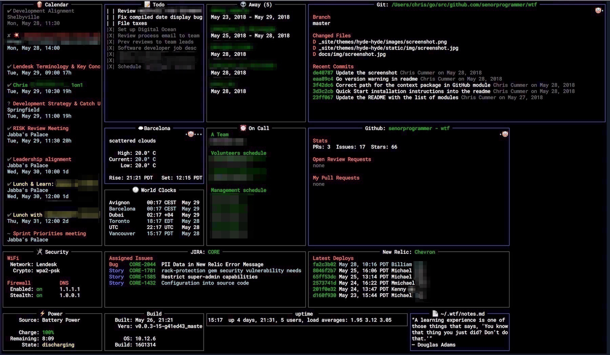

---
title: ░▒▓ modern linux command line tools ▓▒░
author: patrick @drechsler    / hackerkegeln 2019-11
patat:
    slideLevel: 1
    wrap: true
    margins:
        left: 8
        right: 2
    theme:
        emph: [vividBlue, onVividBlack, italic]
        strong: [bold, dullMagenta, onVividBlack]
    images:
        backend: 'w3m'
        path: '/usr/lib/w3m/w3mimgdisplay'
    pandocExtensions:
    - autolink_bare_uris
    - emoji
...

# Slide 1

foo

# A slide with one image



# Demo incremental list1 (using 3 dots)

- foo

. . .

- bar

. . .

- baz

# Target audience

- linux desktop CLI users
- linux admins

```text
  __________________________________________
 / This is the year of linux on the desktop \
|                                            |
|               ;-)                          |
 \                                          /
  ------------------------------------------
        \   ^__^
         \  (oo)\_______
            (__)\       )\/\
                ||----w |
                ||     ||
```

# Linux tooling philosophy

- **do one thing (and only one thing!) well**

- **chaining**

- _sound familiar? (hint: functional programming...)_

# Overview

- `byobu`
- `ranger`
- `fd`
- `bat`

# Unicode & Emojis

Requires font support...

- €
- `&#8364;` (html for unicode euro symbol)
- &#9203;
- `&#9203;` (html)

<!-- 
    &#128169; is the same as 💩 (for details see https://www.fileformat.info/info/unicode/char/1f4a9/index.htm)
-->

# Why? Improvements to...

- **productivity**

- **optics** (aka "unix porn": `PS1`, `STDOUT/ls`)

# You should know the basics

- `cat`, `less`, `find`, `grep`, `awk`, `ssh`/`scp`, `dd`, `rsync`, ...

# shells

**...there is no best shell...**

- bash
- zsh
- fish

# What is the difference between **terminal** and **shell**?

## **terminal**
  
- (default) **colors**
- **font**
- **interactions**
    - keyboard shortcuts
    - mouse interaction

## **shell**

- everything else (f.ex. **`PS1`**)

# fish: The new kid on the block

- https://fishshell.com

- **fisher** / **oh-my-fish**
  - package manager
  
- https://github.com/jorgebucaran/fisher

- category: shell

# zsh

- **oh-my-zsh**: https://ohmyz.sh
  - themes
  - plugins
  - package manager

- category: shell

# bash

- oh-my-bash: https://ohmybash.github.io (~500 stars)
- **bash-it**: https://github.com/Bash-it/bash-it (~10.000 stars)

- category: shell

# byobu

- **byobu** `tmux`-wrapper for non-vim users

    - `tmux` https://github.com/tmux/tmux/wiki

- http://byobu.co/

- category: productivity

# Ranger

- file explorer

- 2 layout options
    - miller columns
    - multipane (similar to Midnight commander)

- key bindings: vi-centric

- with image support for certain terminals
    - `iterms2`
    - `urxvt`
    - `kitty`
    - not `gnome-terminal` (!)

- https://ranger.github.io

- category: navigation, file system

# bat

- `cat` & `less` with syntax highlighting

- https://github.com/sharkdp/bat

- category: read / file display

# fzf

- fuzzy search
- `find * -type f | fzf`
- see `locate` for a static indexer
- category: search

- https://github.com/junegunn/fzf

# fd

- simpler alternative to `find`
- category: search

- https://github.com/sharkdp/fd

# progress

- attach to any kind of copy
- category: monitoring

- https://github.com/Xfennec/progress

# Ultimate Plumber (up)

- interactive piping
- instant live preview

- https://github.com/akavel/up
- category: search, file manipulation, interactive

# lolcat

- Rainbows and unicorns

- https://github.com/busyloop/lolcat
- category: fun, unix porn

# ttyd

- share your terminal over the web

- https://tsl0922.github.io/ttyd/
- category: network, dangerous

# WTF

- personal dashboard

- https://wtfutil.com

# no-more-secrets

- when the tv team comes in your office

- https://github.com/bartobri/no-more-secrets
- category: fun, unix porn

# thefuck

- fix common typos / mistakes
- category: productivity

- https://github.com/nvbn/thefuck

# patat

- nerdy slides in your shell

- Pandoc syntax (f. ex. markdown)

- syntax highlighting

- emojis: :smile:

- `patat` runs in a terminal (similar to `revealJs` for the browser)

- experimental image support in some terminals (same as for `ranger`)
    - `iterm2`
    - `urxvt`
    - `kitty`

- Haskell engine

- category: presentation, slides, unix porn

- https://github.com/jaspervdj/patat

# colorls

- pimp the `ls` command
- NerdFonts
- icons

- https://github.com/athityakumar/colorls
- category: unix porn

# Nice-to-have: use terminal which supports images

- requires new setup
- fonts
- icons
